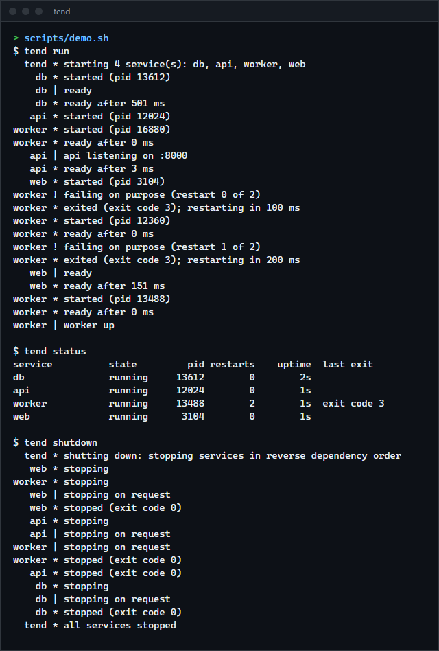

# tend

A small process supervisor: it starts the services listed in a TOML file in dependency order, waits until each is ready before starting what needs it, restarts failures with growing delays, writes each service's output to timestamped, rotated log files, and stops everything in reverse order. For anyone who wants a few local processes (a database, an API, a worker) kept running together without a full init system, or wants to read how one works.

**Status:** v0.1.0, working on Windows. The Unix code (process groups, `SIGTERM`, `SIGKILL`) compiles for Linux (musl) and has not been run. Not published to crates.io.



## How to install

Requires a recent stable Rust (built and tested with 1.98.1).

```sh
git clone https://github.com/r3clusionn/service-manager
cd service-manager
cargo install --path .
```

## How to use

Write a `tend.toml`:

```toml
log_dir = "logs"                 # relative to this file; default "logs"
control = "127.0.0.1:7340"       # where `tend status` and friends connect; this is the default

[service.db]
command = ["postgres", "-D", "data"]
ready = { tcp = "127.0.0.1:5432" }       # ready once the port accepts connections

[service.api]
command = ["python", "api.py"]
depends_on = ["db"]
ready = { log = "listening on" }         # ready once a line of output contains this
env = { PORT = "8000" }
restart = "always"

[service.worker]
command = ["python", "worker.py"]
depends_on = ["db"]
ready = { delay_ms = 500 }               # ready half a second after starting
```

```sh
tend check                 # validate; print the start and stop order
tend run                   # start everything; Ctrl+C stops everything in reverse order
tend status                # from another terminal
tend restart api
tend stop db               # also stops api and worker, which depend on it
tend start worker          # also starts db again
tend logs api -n 50
tend shutdown
```

`--config FILE` (or `-c`) picks another configuration file. `tend run --quiet` keeps service output out of the console; it still goes to the log files.

| Service setting | Default | Meaning |
|---|---|---|
| `command` | (required) | Program and arguments. Not run through a shell. |
| `cwd`, `env` | inherited | Working directory (relative to the configuration file) and extra environment variables. Services also get `TEND_SERVICE` and `TEND_RESTARTS`. |
| `depends_on` | none | Services that must be ready first. |
| `ready` | ready at once | One of `{ delay_ms = N }`, `{ tcp = "HOST:PORT" }`, `{ log = "TEXT" }`. |
| `ready_timeout_ms` | 30000 | Not ready in time: it is stopped and counts as a failure. |
| `restart` | `on-failure` | `always`, `on-failure` (non-zero exit, killed, or not ready in time) or `never`. |
| `backoff_initial_ms`, `backoff_max_ms` | 500, 30000 | The wait before a restart doubles each time, up to the maximum. |
| `max_restarts`, `restart_window_s` | 5, 60 | More restarts than this within the window is a crash loop: the service is marked failed and left alone until `tend start`. A run longer than the window resets the count. |
| `stop_timeout_ms` | 5000 | After asking a service to stop, kill it if it has not exited by then. |

| Top-level setting | Default | Meaning |
|---|---|---|
| `log_dir` | `logs` | One `NAME.log` per service and `tend.log` for the supervisor's own messages. |
| `log_max_bytes`, `log_keep` | 10 MB, 5 | A log reaching the limit is renamed `NAME.log.1` (older ones move up) and a new one started. |
| `control` | `127.0.0.1:7340` | The control address. |

## How it works

- **One thread decides.** It owns every service's state. Other threads only report events to it: a line of output, a process exit, a readiness probe that succeeded, a control request, Ctrl+C. Each event carries the generation of the process it concerns (a counter bumped at every start), so a late event from a process that has been replaced is ignored. Timers (restart, readiness, kill) live in a priority queue the loop sleeps on.
- **Starting.** Services are ordered so each comes after its dependencies (a cycle is reported with its members). A wanted service starts as soon as all its dependencies are ready, so independent services start in parallel.
- **Stopping.** A service that should stop is asked to only once nothing that depends on it is running. Shutdown is "stop everything", which therefore runs in reverse dependency order.
- **Process groups.** Each service runs in its own group: a Job Object on Windows (set to kill its processes when closed), a process group on Unix. Stopping asks politely first: `CTRL_BREAK_EVENT` to the group on Windows, `SIGTERM` to the group on Unix. Killing takes the whole group: `TerminateJobObject`, or `SIGKILL` to the group. So a service started through a script, or one that starts helpers, is stopped with everything it started.
- **Control.** `tend status` and the other commands send one JSON line to the control address and read one back. Each request must carry a token of 32 random bytes that `tend run` writes to `tend.token` in the log directory and removes when it exits: the port is open to every local user, but only someone who can read that file can use it.

## Verification

22 tests (`cargo test --release`): 12 unit tests and 10 that run the supervisor with real child processes (the `testsvc` example: a service that can print, listen on a port, exit with a code, fail a number of times, ignore stop requests, start a grandchild, and record when it started and stopped).

| Test | What it shows |
|---|---|
| dependency order | A service starts only after its dependency's readiness check passed (300 and 200 ms in the test), by the services' own clocks; shutdown stops them in exactly the reverse order; output reaches the logs, timestamped. |
| restarts | A service that fails three times is restarted after 50, 100 and 200 ms and then runs. |
| crash loop | A service that keeps failing is marked failed after `max_restarts`; `tend start` gives it another round. |
| policies | `never` does not restart after a failure, `on-failure` does not restart after a clean exit, `always` does. |
| stop timeout | A service that ignores the stop request is killed after `stop_timeout_ms`, and so is the grandchild it started. |
| readiness timeout | A service that never logs its ready message is stopped and counted as failed, and what depends on it never starts. |
| commands | Stopping a service stops what depends on it, starting one starts what it needs, restarting gives a new process. |
| logs | Rotation at the size limit keeps the configured number of old files. |
| control | A request with a wrong token is refused and changes nothing. |
| errors | A dependency cycle, a missing supervisor, and a program that does not exist are reported plainly. |

The whole suite was run 40 times in a row without a failure. An earlier batch of 25 runs failed 6 times; the cause was the test service itself, whose marker-file writes from several processes could interleave. Each line is now one write.

Mutation checks (break one thing, confirm a test fails): 22 changes, such as starting before dependencies are ready, stopping before dependents have exited, an off-by-one in the crash-loop limit, a backoff that never grows, restart policies swapped, no kill timer, no readiness timeout, a cycle not detected, the token not checked. 18 are caught. Of the rest:

- Leaving out the check that ignores exit events from a replaced process changes nothing today: a new process is only started after the old one's exit has been handled. The check stays as a guard.
- Killing only the service's own process instead of its Job Object still kills the grandchild in the test, because closing the Job Object when the service exits kills what is left in it. The two mechanisms back each other up.
- Not deleting the oldest log file before rotating is equivalent: renaming over it replaces it anyway.
- Starting services without their own process group could not be tested this way: the stop signal then went to every process on the console, which ended the test run itself. That is the reason the flag is there.

## Limits

- Only Windows was run. On Unix the services' process groups and signals compile but are untested.
- On Windows the polite stop (`CTRL_BREAK_EVENT`) only reaches services that share the supervisor's console, which is the case when `tend run` is started from a terminal. Without a console (started by a scheduler, say), services are killed instead of asked.
- A process a service starts in the instant before it is placed in its Job Object escapes the group. Rust's process API cannot start a process suspended, which would close the gap.
- The TCP readiness check on Windows: connecting to a port nobody listens on yet times out instead of being refused at once, so readiness is noticed up to about 250 ms late.
- Dependencies matter only for starting and stopping. If a dependency crashes and restarts, the services that depend on it keep running and are not restarted.
- No health checks after start, no resource limits, no running as another user, no socket activation, no reload of the configuration while running.
- The control port is plain TCP on the loopback interface; the token keeps out other local users who cannot read the log directory, nothing more.

## License

MIT (see `LICENSE`).
